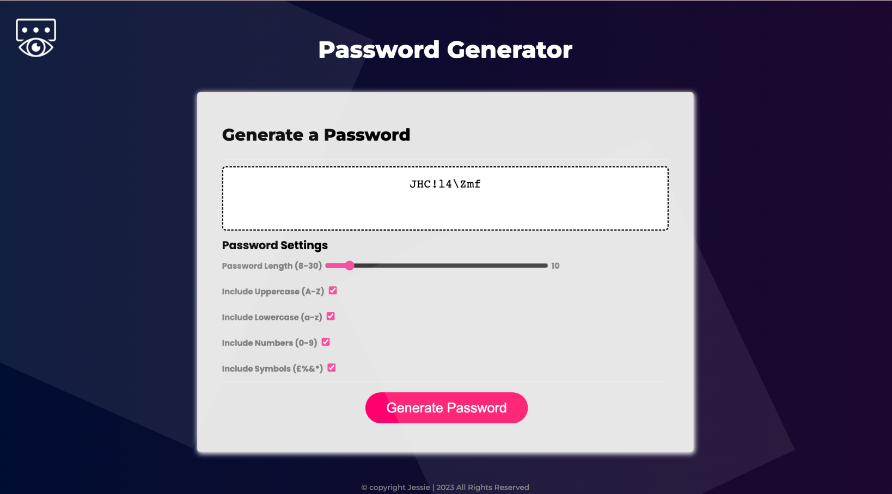

# Password-Generator

## Overview
The password generator is a tool designed for employees to effortlessly generate a secure and unique password through selecting preferred settings. It runs within a web browser and utilizes JavaScript to update the HTML and CSS for a user-friendly experience.

## Instructions:

    1. Select the desired length and choose from the available character types.

    2. Character Types:
    • Uppercase
    • Lowercase
    • Numeric
    • Special characters

    3. Adjust the length of the password using the slider, with a minimum of 8 characters
    and a maximum of 30 characters.
    4. Click the button to generate a password.
    
    Note that at least one character type must be selected for the password to be displayed,
    otherwise an "undefined" message will appear.

## Deployment:
Link: https://kingjessie.github.io/Password-Generator/


## What I learned:

I learned how to create web applications using JavaScript, specifically how to select elements from the HTML document by their id using the querySelector() method, and how to attach an event listener to an element such as a button, and execute a desired function when the event occurs using the addEventListener() method.

Example 1:
I created a section for the user to select the desired password length using a range input and a span element to display the selected length.

```html
      <div class="pw-body">
          <div class="form-options">
            <label for="p-length">Password Length (8-30)</label>
            <input type="range" id="p-length" value="12" min="8" max="30" />
            <span id="sliderNum"></span>
          </div>
```
Example 2:
The event listener is used to ensure that when the user moves the slider to select the desired password length, the number of characters selected is displayed in the span element with the id "sliderNum". As the user changes the slider position, the number shown in the span element will be updated to match the new password length.

```Javascript
// The selected password length, as determined by the user's selection on the slider,
// is reflected and updated on the span element with the id=sliderNum.
document.querySelector("#p-length").addEventListener("input", function(){
document.querySelector("#sliderNum").innerHTML = this.value;
});
```

## ScreenShot


## Acknowledgments:

- Mozilla Developer Network: https://developer.mozilla.org/en-US/docs/Web/CSS 
- W3schools: https://www.w3schools.com/css
- ZinoTrust Academy: https://www.youtube.com/watch?v=MW1wz-PAOaE&t=416s
- CodingLab: https://www.youtube.com/watch?v=VueCBHswEps
- Traversy Media: https://www.youtube.com/watch?v=duNmhKgtcsI&t=807s


## Author:
Jessie - Copyright (c) 2022 KingJessie
